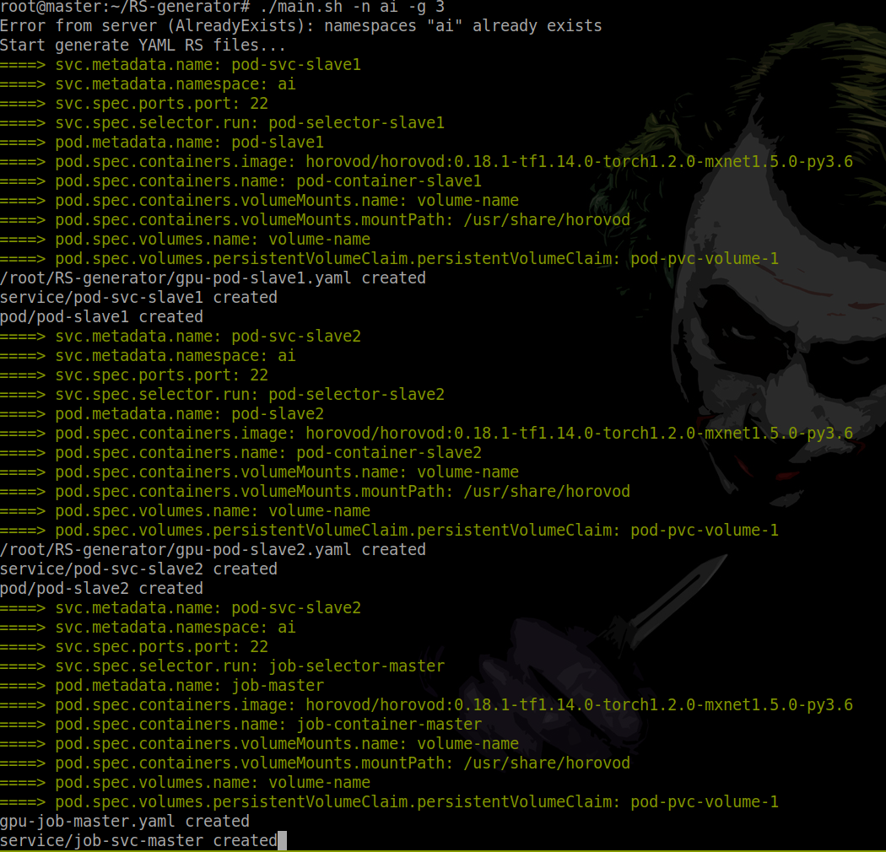

# RS-generator

**初衷:**
在基于kubernetes分布式训练平台下，进行分布式训练时，当以传统方式创建各种资源(pods, jobs, svc, deploymets..)对于专注于训练算法层面的朋友来说是繁琐的. 于是这个项目就是设法将此工程以更加简便，更见直观的方式呈现出来，将资源创建的各种细节隐藏起来. 

**现状:**
当然，RS-generator不能做到面面俱到, 他最主要的是创建了一些可扩展性的模板，以及回收等功能.



它默认支持的是使用horovod运行的方式, 当然如果需要进行执行指令的更改，可以通过
```
./main.sh balabala -e false
```
来使得这些资源配置文件是生成而不执行的. 根据自己的需求，进行更改后，将`-e false`参数去掉或者写成`-e true`再执行一遍, 即可将其运行起来. 


移植于

[K8s4ml](https://github.com/ReyRen/K8s4ML)

和

[K8sNvidia](https://github.com/ReyRen/K8sNvidia)

由于感觉对于分布式训练来说，实用性很强，所以单独拎出来了...

[NFS持久化存储参考](https://www.cnblogs.com/linuxk/p/9760363.html)

## Usage:
```
#
# usage:
# If you want to use 2 GPUs to do the trainning:
#       ./main.sh -g 2
# If you want to specify the NAMESPACE with 3 GPUs to do the trainning:(default namespace will be use if without -n NAMESPACE)
#       ./main.sh -n ai -g 3
# If you want to use 2 CPUs to do the trainning:
#       ./main.sh -c 2
# If you want to specify the NAMESPACE with 3 CPUs to do the trainning:(default namespace will be use if without -n NAMESPACE)
#       ./main.sh -n ai -c 2
# If you want to mix GPUs and CPUs:
#       ./main.sh -n ai -g 2 -c 2
#
#

```

