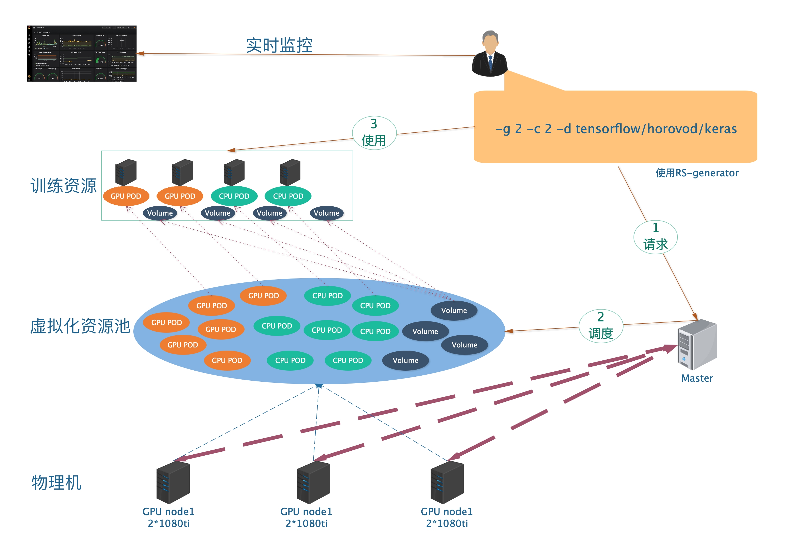
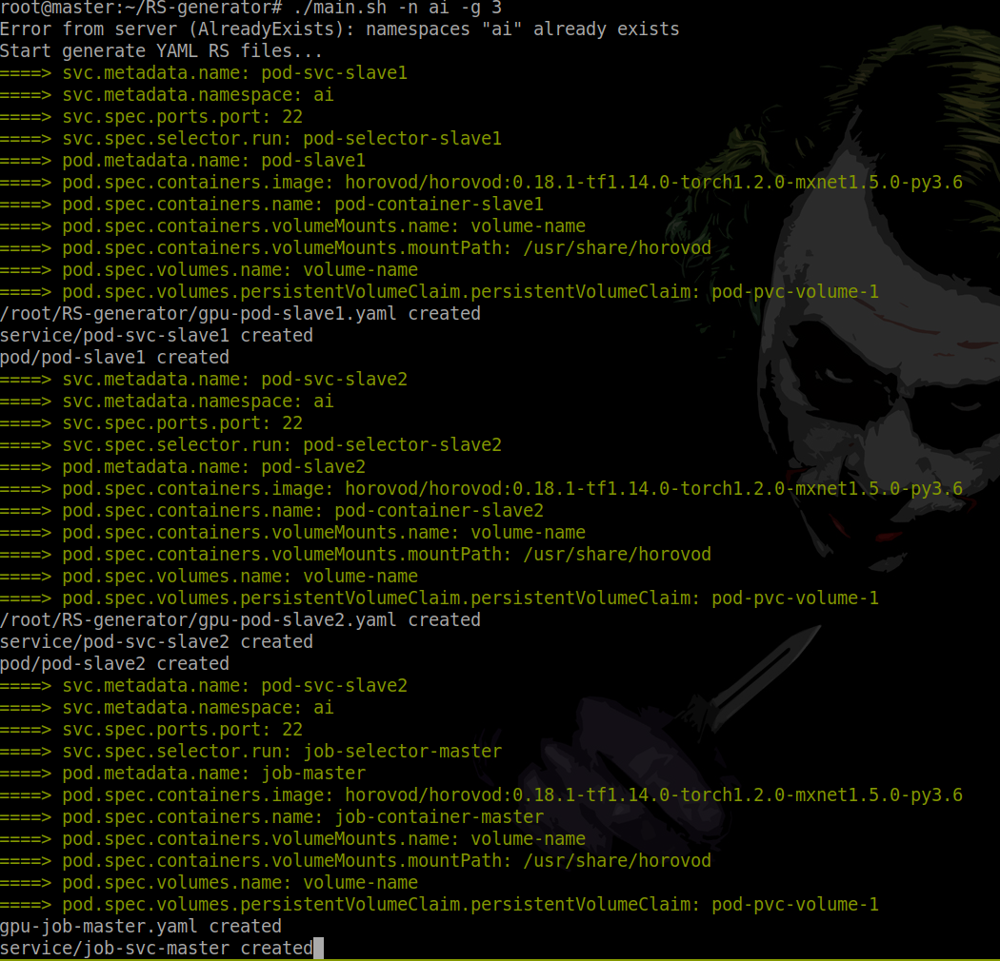
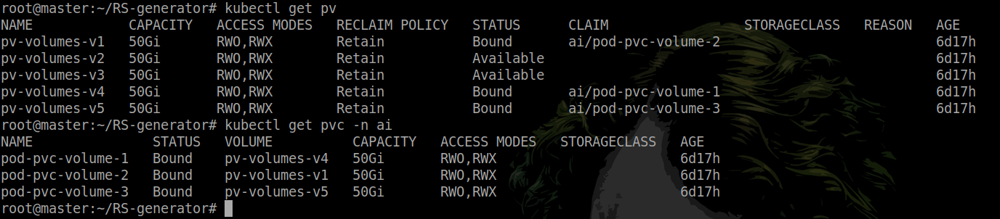

# RS-generator
**架构图:**


**初衷:**
在基于kubernetes分布式训练平台下，进行分布式训练时，当以传统方式创建各种资源(pods, jobs, svc, deploymets..)对于专注于训练算法层面的朋友来说是繁琐的. 于是这个项目就是设法将此工程以更加简便，更见直观的方式呈现出来，将资源创建的各种细节隐藏起来. 

**现状:**
当然，RS-generator不能做到面面俱到, 他最主要的是创建了一些可扩展性的模板，以及回收等功能.



从图中可以看出，绿色的打印输出部分就是一些常规的RS中的配置信息，这样很方便的战士出来，可以让使用者知道，自动生成的这个RS模板副不符合我的预期. 当然, `args`是没有扔出来的，那个有点大，后期需要完善的时候，有时间再规划规划吧.

它默认支持的是使用`horovod`运行的方式, 当然如果需要进行执行指令的更改，可以通过
```
./main.sh balabala -e false
```
来使得这些资源配置文件是生成而不执行的. 根据自己的需求，进行更改后，将`-e false`参数去掉或者写成`-e true`再执行一遍, 即可将其运行起来. 

目前针对horovod生成的模板中使用的是build好的[GPU image](generate_gpu_rs.py), 但是也是支持[CPU image](generate_cpu_rs.py)的，只不过没有build，需要的话可以自行进行编译或者去docker hub上搜索. 

## 使用前提

* 拥有一个稳健的Kubernetes集群(参考[K8s4ml](https://github.com/ReyRen/K8s4ML) & [K8sNvidia](https://github.com/ReyRen/K8sNvidia))
* 拥有一个NFS持久化PV/PVC(参考[NFS持久化存储参考](https://www.cnblogs.com/linuxk/p/9760363.html))，当然也可以是其他持久化存储，但是相应的RS属性得更改一下.


从上面看到我使用的是`pod-pvc-volume-1`这个`ai`命名空间下的pvc

**pvc的namespace需要和创建资源的namespace一致，不然不能跨namespace使用**

## 使用
首先查看粗粒度使用信息:
```
./main.sh -h
```
如果想要创建2个GPU的训练:
```
./main.sh -g 2
```
如果想要指定命名空间并且使用3个GPU进行训练(如果不指定`-n`,那就是`default`命名空间使用):
```
./main.sh -n NAMESPACE -g 3
```
如果是想使用2个CPU进行训练:
```
./main.sh -c 2
```
如果想要指定命名空间并且使用3个CPU进行训练:
```
./main.sh -n NAMESPACE -c 3
```
如果想要混合使用:
```
./main.sh -n NAMESPACE -g 2 -c 2
```
如果想要删除命名空间下的所有资源(清空使用):

**危**：如果上面创建是在默认的`default`命名空间下, 请不要使用这个命令指定`default`, 因为`defualt`命名空间下有集群重要组件
```
./main.sh -D NAMESPACE
```
默认是创建RS文件并且执行起来的，如果想要进行修改，或者不想让马上执行，而只是想拿到模板文件:
```
./main.sh -e false
```
